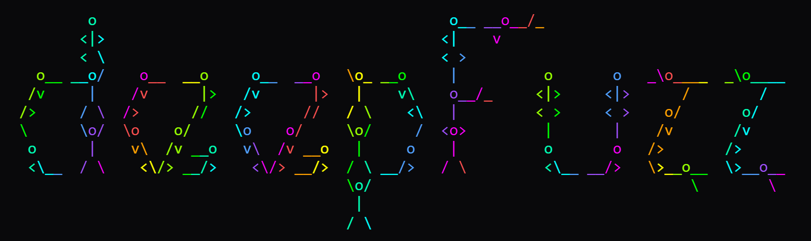

# DeepFuzz



deepFuzz is Stealth-oriented, high-performance content discovery and fuzzing tool for modern web apps and APIs purpose-built to minimize false positives and slip past noisy WAF heuristics. **For authorized security testing only.**

## Why DeepFuzz?

Existing tools of the similar functionality are fantastic, but they trade speed for stealth and lack AI-ready feedback loops. **DeepFuzz** is designed for bugbounty-scale and red-team conditions:

* **Minimal False Positives** TLSH fuzzy hashing + MinHash clustering; session-aware replay and context filtering.
* **Advanced-level Evasion** JA3/JA4+ TLS fingerprint rotation, adaptive headers, payload mutations, HTTP/2(+3 where supported), timing jitter.
* **Hybrid Wordlists** Target-specific dictionaries sourced from Common Crawl, GitHub, and JS analysis.
* **DOM-Informed JS Recon** Static + dynamic JS analysis to surface API routes and hidden endpoints.
* **Distributed Mode** Redis-backed job fabric for 1M+ req/min across global agents.
* **AI-Ready** gRPC bridges for path prediction, response similarity, and WAF-bypass payload generation.

## Features at a Glance

* **Fingerprinting & De-dup** TLSH + MinHash reduce noise from mirrored CDN/WAF pages.
* **Timing Side-Channels** Microsecond-precision deltas to spot behavioral blocks vs. real 404/403.
* **Personas** Header/JA3/behavior profiles to blend in (crawler, browser, API client).
* **Replay Engine** Revalidate suspects under different personas to eliminate FPs.
* **Adaptive Queue** Prioritizes promising paths using heuristics or optional AI gRPC.
* **Covert Ops** Optional DNS tunneling prototype and encrypted control channels for contested environments.

## Quick Start

### Requirements

* **Go** ≥ 1.21 (tested on 1.22+)
* **Redis** ≥ 6.x (only if you use `--cluster`)
* **Python** ≥ 3.10 (only if you run the optional AI services)
* Linux/macOS/WSL2 recommended

### Build

```bash

go build -o bin/deepfuzz ./cmd/deepfuzz
```

## CLI Reference (`--help`)

```
deepfuzz --help

	      o                                         o__ __o__/_                             
        <|>                                       <|   v                                  
        < \                                       < >                                      
   o__ __o/    o__  __o     o__  __o   \o_ __o     |          o       o   _\o____  _\o____ 
  /v     |    /v      |>   /v      |>   |    v\    o__/_     <|>     <|>      /        /   
 />     / \  />      //   />      //   / \    <\   |         < >     < >    o/       o/    
 \      \o/  \o    o/     \o    o/     \o/     /  <o>         |       |    /v       /v     
  o      |    v\  /v __o   v\  /v __o   |     o    |          o       o   />       />      
  <\__  / \    <\/> __/>    <\/> __/>  / \ __/>   / \         <\__ __/>   \>__o__  \>__o__ 
                                       \o/                                     \        \  
                                        |                                                  
                                       / \                                                 

		             High Performance Discovery tool v1.0 


Usage:
  deepfuzz [flags]

Flags:
  -u, --target string         Target URL (required)
  -g, --github-org string     GitHub organization to mine
  -c, --common-crawl          Enable time machine analysis
  -r, --recursion int         Max recursion depth (default 5)
  -o, --output string         Output file base name (default "results")
  -s, --stealth               Enable nuclear stealth mode
      --cluster string        Redis cluster address
      --ai                    Enable AI threat modeling (default true)
      --threat string         Threat model (apt41, ransom, nation) (default "apt41")
      --autopwn               Enable auto-exploitation
  -h, --help                  Show help
```

## Usage Examples (option-by-option)

### 1) Minimal run (required target)

```bash
bin/deepfuzz --target https://shop.example.com
```

### 2) Increase recursion depth and set output base name

```bash
bin/deepfuzz --target https://api.example.com --recursion 7   --output results/api_example
```

This explores deeper link graphs and writes artifacts to `results/api_example.*`.

### 3) GitHub-assisted recon for an org

```bash
bin/deepfuzz --target https://portal.example.com --github-org example-inc
```

Mines public repos under `example-inc` for endpoints/wordlists to bias the queue.

### 4) Time-machine enrichment via Common Crawl

```bash
bin/deepfuzz --target https://www.example.com --common-crawl
```

Pulls historical snapshots to surface legacy routes, backups, and forgotten panels.

### 5) Stealth persona + timing jitter

```bash
bin/deepfuzz --target https://secure.example.com --stealth
```

Enables header/JA3 rotation, pacing/jitter, and stricter replay logic.

### 6) Distributed mode (Redis)

```bash
# Start Redis somewhere reachable (example: local)
redis-server --port 6379

# Run DeepFuzz connected to the fabric
bin/deepfuzz --target https://fleet.example.com --cluster redis://127.0.0.1:6379
```

Allows job distribution/load reporting across multiple agents (when you run multiple instances with the same `--cluster`).

### 7) Disable AI assistance

```bash
bin/deepfuzz --target https://app.example.com --ai=false
```

Runs fully heuristic (useful for isolated environments or when AI servers aren’t available).

### 8) Select a threat model preset

```bash
bin/deepfuzz --target https://panel.example.com --threat ransom
```

Tunes prioritization & evasion heuristics for the given adversary profile (`apt41`, `ransom`, `nation`).

### 9) Enable `autopwn` chain 

```bash
bin/deepfuzz --target https://lab.example.com --autopwn
```

Attempts safe exploitation chains on high-confidence hits (scope-controlled). **Use only with explicit permission.**

## Output

By default, results are written under the base name provided via `--output` (e.g., `results`, `results/api_example`). The engine also prints a high-level “battle assessment” at the end of a run and can export JSON/HTML reports when enabled in the build.

## FAQ — Five Questions You Should Ask

1. **How does DeepFuzz keep false positives low?**
   TLSH + MinHash fingerprinting, replay under alternate personas, and timing-variance analysis separate real surfaces from mirrored WAF/CDN noise. Optional similarity AI tightens validation further.

2. **Will this replace ffuf/gobuster/dirsearch for me?**
   If you need **stealth, adaptive queueing, and cluster scale**, DeepFuzz can become your primary discovery engine. For quick sweeps or simple lists, classic tools still shine.

3. **What if the target runs an aggressive WAF/CDN?**
   Stealth personas rotate JA3/headers, spacing, and payload mutations; we also detect behavioral blocks via micro-timing and re-probe with alternate personas before recording a hit.

4. **Do I need the AI pieces to get value?**
   No. AI is optional. The core engine (evasion + clustering + recon) works out of the box. If you enable AI gRPC services, you’ll get smarter prioritization and stricter FP control.

5. **Is distributed mode production-safe?**
   Yes, when used within scope. The Redis fabric is designed for large fleets, with adaptive load tracking and dead-letter handling. Secure your Redis and network per your org’s policy.

## 🛠️ Troubleshooting
- If you encounter any issues, please [open an issue](https://github.com/bl4ck0w1/deepFuzz/issues) on GitHub.

## Contributing

We welcome contributions! Please see our [Contributing Guidelines](CONTRIBUTING.md) for details.

1. Fork the repository
2. Create a feature branch (`git checkout -b feature/amazing-feature`)
3. Commit your changes (`git commit -m 'Add amazing feature'`)
4. Push to the branch (`git push origin feature/amazing-feature`)
5. Open a Pull Request

## License

This project is licensed under the MIT License - see the [LICENSE](LICENSE) file for details.

## Author

### Elie Uwimana 😎
- [LinkedIn](www.linkedin.com/in/elie-uwimana)

## Compliance & Ethics

⚠️ **Authorized Use Only** - DeepFuzz is designed for:
- Penetration testing with explicit written permission
- Bug bounty programs within platform guidelines  
- Government cybersecurity operations
- Academic research in controlled environments
